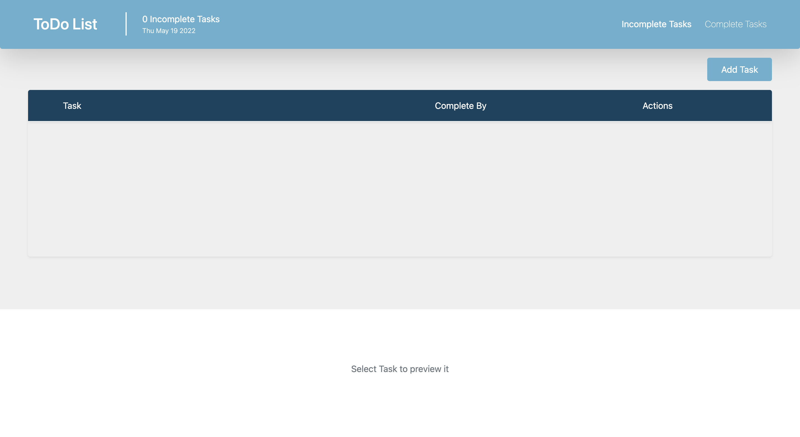

# ToDo App 


## About the project
This project consists of an application that allows you to add, delete, edit, complete and activate/desactivate assigned tasks. 

## Built with

- HTML
- CSS
- JS
- Node.js.

## Setup

For this proyect we need dependencies such as:

#### Node
Install Node.js [here](https://nodejs.org/es/download/)

#### Install
1. Clone the repo
   ```sh
   git clone https://github.com/MateoCaicedoW/Training
   ```
For install node modules we have to enter the following commands in the terminal

2. ```sh
    npm install ejs
   ``` 

3. ```sh
    npm install express
   ```  

4. ```sh 
    npm install morgan
    ```  

5. ```sh 
    npm install --save-dev nodemon
    ``` 

6. ```sh  
    npm install --save-dev browserify
    ``` 

7. ```sh 
    npm install jest
    ``` 

#### Run
For run this proyect we have enter the following commands in the terminal

1. Build app
   ```sh
   npm run build
   ```
2. Run app
   ```sh
   npm start
   ```
3. Copy on the browser 
    ```sh
    localhost:4000
    ```

## Contributing
Mateo Caicedo